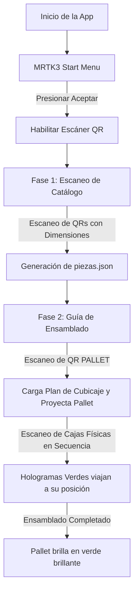

# Manual de Usuario Básico - CubicajeHL3

**CubicajeHL3** es una aplicación de Realidad Mixta (MR) diseñada para dispositivos **Microsoft HoloLens 2**. Su objetivo es asistir a un operario de empaque (packer) en la colocación eficiente de piezas tridimensionales dentro de un pallet, utilizando visualizaciones holográficas interactivas y un algoritmo inteligente de distribución (cubicaje).

---

## 📋 Requisitos Previos

Para utilizar la aplicación necesitas:
1. Un dispositivo **HoloLens 2** con la aplicación instalada.
2. Códigos QR impresos (ver sección de [Formatos de Códigos QR](#-formatos-de-códigos-qr)).
3. Un espacio de trabajo despejado y bien iluminado para asegurar el correcto seguimiento de las manos y el escaneo de los QRs.

---

## 🔄 Los Dos Flujos de Trabajo de la Aplicación

La aplicación opera bajo dos modalidades que se complementan en cada sesión de trabajo:

### 1. Fase de Catálogo: Escaneo y Registro de Piezas
En esta fase registras en la base de datos local de la aplicación las dimensiones reales de cada caja que vas a empacar.
- **Acción:** Apunta con la mirada a los códigos QR de dimensiones de las piezas.
- **Feedback:** Al detectar un código válido, aparecerá un holograma de color **cian** (azul celeste) con las dimensiones reales de la pieza en la posición del QR durante **1 segundo**.
- **Guardado:** La aplicación añade la pieza a una lista y guarda automáticamente los datos en un archivo llamado `piezas.json` en la memoria del dispositivo.

### 2. Fase de Ensamblado: Guía de Cubicaje en Tiempo Real
En esta fase la aplicación calcula la distribución óptima y guía tus movimientos para acomodar las piezas dentro del pallet virtual.
- **Paso 1: Anclar el Pallet.** Escanea el código QR que dice `PALLET`. Esto leerá las piezas registradas, ejecutará el motor de distribución y proyectará un pallet holográfico semi-transparente flotando sobre el código QR. El pallet se orientará automáticamente de frente a tu posición.
- **Paso 2: Colocación de Piezas.** El sistema calcula una secuencia ordenada para colocar las piezas (priorizando llenar el pallet de abajo hacia arriba, de atrás hacia adelante y de izquierda a derecha).
  - **Pieza Correcta:** Si escaneas la pieza física correspondiente al paso actual en la secuencia, verás un holograma de color **verde** que vuela desde el código QR hasta su ranura designada en el pallet.
  - **Pieza Incorrecta:** Si escaneas una pieza que no corresponde al orden actual, aparecerá un holograma de color **rojo** sobre el QR durante **1 segundo** indicando el error. La pieza no se moverá al pallet.
- **Paso 3: Finalización.** Al colocar la última pieza correctamente, la pared trasera del pallet holográfico parpadeará en un **verde brillante**, indicando que el pallet se ha completado con éxito.

---

## 🏷️ Formatos de Códigos QR

Para que el sistema reconozca los códigos QR, deben estar configurados exactamente con los siguientes textos:

| Tipo de Objeto | Contenido del QR | Propósito | Ejemplo |
| :--- | :--- | :--- | :--- |
| **Pallet** | `PALLET` | Ancla el pallet holográfico en el espacio físico. | `PALLET` |
| **Pieza (Fase 1: Catálogo)** | `ID;alto;ancho;fondo` | Registra el ID de la pieza y sus dimensiones (en **metros**). | `A1;0.166;0.083;0.0415` |
| **Pieza (Fase 2: Ensamblado)**| `ID` | Identifica la caja física al momento de colocarla en el pallet. | `A1` |

> [!IMPORTANT]  
> En la Fase 1, las dimensiones de la pieza en el código QR deben expresarse en **metros** utilizando el punto (`.`) como separador decimal. Ejemplo: para una caja de 16.6 cm de alto, 8.3 cm de ancho y 4.15 cm de fondo, el valor en el QR debe ser `0.166`, `0.083` y `0.0415`.

---

## 🚶 Guía Paso a Paso para una Prueba Exitosa

Sigue este procedimiento exacto para realizar tu primera simulación completa:

### Paso 1: Preparación
1. Imprime o muestra en una pantalla los siguientes códigos QR:
   - Un código QR con el texto: `PALLET`
   - Un código QR de dimensiones: `A1;0.10;0.10;0.10` (una caja cúbica de 10 cm)
   - Un código QR de dimensiones: `A2;0.10;0.10;0.10` (otra caja cúbica de 10 cm)
   - Dos códigos QR simples para las cajas físicas: uno que diga `A1` y otro que diga `A2`.

### Paso 2: Encendido y Menú Inicial
1. Enciende el HoloLens 2 y abre la aplicación **CubicajeHL3**.
2. Al iniciar, verás una cartelera holográfica flotante frente a ti.
3. Apunta con tu mano y presiona el botón virtual **Aceptar** (Accept). El menú desaparecerá, activando la cámara del HoloLens para el reconocimiento de códigos QR.

### Paso 3: Registro de Catálogo
1. Mira fijamente el código QR `A1;0.10;0.10;0.10`. Verás un cubo cian de 10x10x10 cm aparecer sobre el código durante 1 segundo.
2. Espera 2 segundos (cooldown global de seguridad).
3. Mira fijamente el código QR `A2;0.10;0.10;0.10`. Verás otro cubo cian aparecer por 1 segundo.
4. Las dos piezas ya se encuentran guardadas en la base de datos interna.

### Paso 4: Generación del Pallet Virtual
1. Dirige tu mirada al código QR con el texto `PALLET`.
2. Verás aparecer un pallet holográfico azul semi-transparente en esa ubicación. El pallet mide aproximadamente 21x21x21 cm y tiene las paredes abiertas hacia ti.

### Paso 5: Proceso de Empaque
1. El algoritmo de cubicaje habrá determinado un orden de ensamblado (por ejemplo, primero `A1` y luego `A2`).
2. Toma la caja física etiquetada con el QR `A2` (pieza incorrecta en el orden actual) y mírala. Verás un cubo **rojo** sobre ella que desaparece rápidamente.
3. Ahora mira la caja física etiquetada con el QR `A1` (pieza correcta). Un cubo **verde** aparecerá y viajará en una curva descendente hasta asentarse en la esquina del pallet virtual.
4. Finalmente, escanea la pieza `A2`. El cubo verde viajará a su posición al lado de la pieza `A1`.
5. La pared trasera del pallet cambiará a verde brillante, confirmando que la tarea ha finalizado con éxito.
